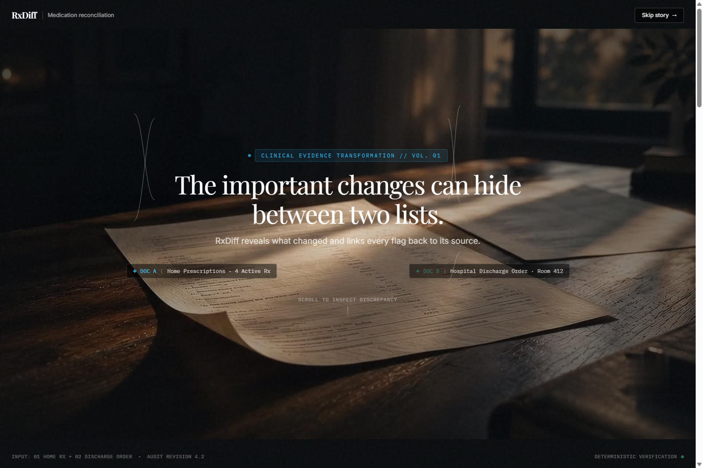
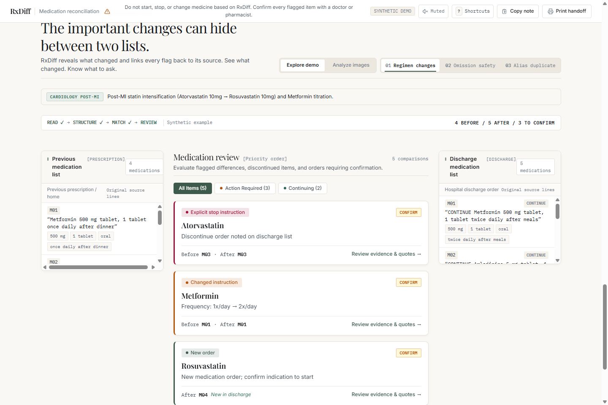
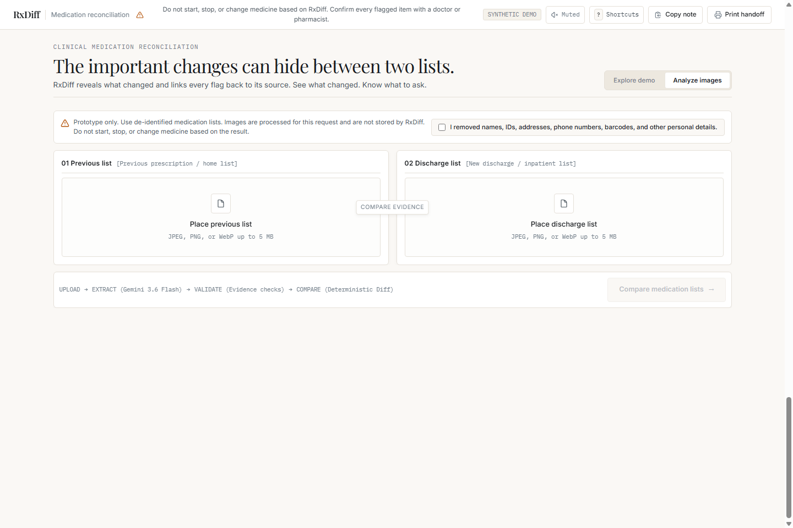

# 🩺 RxDiff · Deterministic Clinical Medication Reconciliation 💊

<p align="center">
  <a href="https://drive.google.com/file/d/1Vn3KboK0jClShztNo4HdSVCNFss7YVbS/view?usp=sharing" target="_blank">
    
  </a>
  
  
  
  
  
  
</p>

---

> ### 🎥 **LIVE DEMO VIDEO WALKTHROUGH**
> 
> 🔗 **Direct Video Link:** [**Watch RxDiff Live Demo on Google Drive**](https://drive.google.com/file/d/1Vn3KboK0jClShztNo4HdSVCNFss7YVbS/view?usp=sharing)  
> *Full end-to-end clinical workflow demonstration: prescription document ingestion, Gemini multimodal extraction, deterministic diff engine reconciliation, safety guardrails, tri-column verification canvas, and EHR handoff note export.*

---

## 📖 Executive Summary

> ⚠️ **CLINICAL MANDATE:** *Hospital transitions (admission to discharge) account for over **50% of all hospital medication errors**. Unintentional omissions, unrecognized brand-generic therapeutic duplications, and subtle dose frequency titrations frequently escape manual review.*

**RxDiff** is an enterprise clinical decision-support workbench built on a **two-tier air-gapped architecture**:
1. 👁️ **Multimodal Vision Extractor (Gemini)**: Acts exclusively as a high-fidelity OCR and structured entity reader. It never reasons, validates, diagnoses, or classifies medication changes.
2. ⚙️ **Pure Deterministic Diff Engine**: A 100% mathematical, rule-bound reconciliation engine that computes discrepancies, detects omissions, prevents therapeutic duplications, and anchors every clinical flag directly to verbatim image evidence.

📺 **Live Demo Video**: [Watch the full demonstration on Google Drive](https://drive.google.com/file/d/1Vn3KboK0jClShztNo4HdSVCNFss7YVbS/view?usp=sharing)

---

## 📸 System Visual Tour

### 🎬 01 · The Narrative Journey (Clinical Transition Context)
> *An interactive, scroll-driven visual journey grounding clinicians and caregivers in the high-stakes reality of post-discharge medication transitions.*

<p align="center">
  
</p>

---

### 🔬 02 · Clinical Reconciliation Canvas (Tri-Column Inspection)
> *Side-by-side verification: Home Medication Orders (left), Prioritized Discrepancy Matrix (center), and Hospital Discharge Orders (right).*

<p align="center">
  
</p>

---

### 📷 03 · Multimodal Vision Studio (Live Prescription Ingestion)
> *Dual-document drag-and-drop & native camera capture with pre-flight de-identification safeguards and fail-closed quote verification.*

<p align="center">
  
</p>

---

## 🛡️ 10 Non-Negotiable Medical Safety Guardrails

| # | 🛡️ Safety Invariant | 📋 Clinical Enforcement Mechanism | ⚖️ Regulatory Rationale |
|---|---|---|---|
| **01** | 🚫 **No Prescription Recommendations** | RxDiff never prescribes, alters, or calculates clinical dosages. | Prevents unauthorized medical practice. |
| **02** | 🔍 **Omission $\neq$ Discontinuation** | Missing items in discharge orders are flagged as `needs_confirmation`, NEVER `stopped`. | Prevents inadvertent cessation of chronic meds (e.g. Levothyroxine). |
| **03** | 🛑 **Explicit Stop Requirement** | A medication is only marked `explicitly_stopped` if an explicit "STOP/HOLD/DISCONTINUE" directive exists. | Eliminates silent medication terminations. |
| **04** | ❓ **Null vs Known Discrepancy** | When route, dose, or frequency is missing in one document, flagged as `needs_confirmation`. | Prevents assuming unstated clinical parameters. |
| **05** | 🔤 **Fuzzy Matching $\neq$ Equivalence** | Sound-Alike/Look-Alike (LASA) phonetic similarities trigger safety flags, never auto-merging. | Guards against fatal mix-ups (e.g. Hydralazine vs Hydroxyzine). |
| **06** | 🏷️ **Transparent Alias Registry** | Brand-generic equivalences (e.g., *Glucophage* ↔ *Metformin*) rely strictly on a transparent audited table. | No opaque LLM inferences for chemical equivalence. |
| **07** | 🧾 **Verbatim Evidence Anchoring** | Every extracted pill must match verbatim printed text quotes in the source document. | Eliminates hallucinations; guarantees source provenance. |
| **08** | 🎚️ **Threshold Fallbacks** | Low extraction confidence or unverified quotes fail-closed into `needs_confirmation`. | Eliminates false-negative clinical risks. |
| **09** | 📝 **Deterministic Templates** | All clinical rationales use immutable static templates, never generative LLM summaries. | 100% reproducible audit trails. |
| **10** | 🪜 **Multi-Field Precedence** | Conflict ranking follows strict clinical hierarchy: `route > dose > strength > frequency`. | Prioritizes highest-acuity changes first. |

---

## ⚡ Core Feature Matrix

```
📦 RxDiff Engine
 ├── 👁️ Ingestion Tier
 │    ├── 📷 Live Device Camera Capture (Mobile & Tablet)
 │    ├── 📁 Dual Drag-and-Drop Ingestion (JPEG / PNG / WebP up to 5 MB)
 │    ├── 🔒 Client-Side De-Identification Checkpoint
 │    └── 🛡️ Strict File Type & Dimension Validation
 │
 ├── 🧠 Extraction Tier (api/extract.ts)
 │    ├── ⚡ Gemini Multimodal Vision Reader (gemini-3.5-flash)
 │    ├── 🔄 Automatic Retry with Jitter & Dynamic Model Failover
 │    ├── ⏱️ 60-Second Extended Execution Window (Vercel maxDuration)
 │    └── 🧪 Verbatim Quote Substring Normalization
 │
 ├── ⚙️ Reconciliation Core (src/engine/diffEngine.ts)
 │    ├── 🏷️ Transparent Brand-Generic Synonym Mapping
 │    ├── 🚨 Duplicate Order Detection (Dual Therapy Protection)
 │    ├── 🔠 Precision Character & Word-Level Change Diffing
 │    └── 🎯 Clinical Categorization (Stopped, Changed, Started, Unchanged)
 │
 └── 🖥️ Clinician Interface (src/components/)
      ├── 📑 Tri-Column Side-by-Side Context Sync
      ├── 🔘 Quick Category Filter Tabs (Action Required vs Continuing)
      ├── 🔊 Web Audio API Micro-Haptics (Auditory Confirmation Feedback)
      ├── 📋 1-Click Formatted EHR Handoff Note Export
      ├── 🖨️ Clean High-Contrast Printable Clinical Summary
      └── ⌨️ Complete Power-User Keyboard Navigation (`?`, `1-4`, `Alt+1-3`)
```

---

## ⌨️ Clinician Keyboard Navigation

| ⌨️ Keybinding | 🎯 Action | 💡 Clinical Purpose |
|---|---|---|
| <kbd>?</kbd> | 📖 **Toggle Shortcuts Modal** | Quick reference for operating theatre / rounds. |
| <kbd>Alt</kbd> + <kbd>1</kbd> | 📁 **Select Case A** | Cardiac Post-MI Statin & Titration scenario. |
| <kbd>Alt</kbd> + <kbd>2</kbd> | 📁 **Select Case B** | Endocrinology Omission Safety scenario. |
| <kbd>Alt</kbd> + <kbd>3</kbd> | 📁 **Select Case C** | Brand-Generic Duplicate Prevention scenario. |
| <kbd>1</kbd> | 🏷️ **Filter: All Items** | Show complete reconciled medication list. |
| <kbd>2</kbd> | 🚨 **Filter: Action Required** | Focus exclusively on changes, stops, and omissions. |
| <kbd>3</kbd> | ✅ **Filter: Continuing** | Review verified unchanged medications. |
| <kbd>Esc</kbd> | ✖️ **Dismiss Modal** | Immediately close active dialogs or drawers. |

---

## 🧪 Synthetic Clinical Benchmark Cases

<details>
<summary><b>Case A · Cardiology Post-MI Regimen Optimization</b></summary>

* **Clinical Context**: 62-year-old post-NSTEMI patient transitioning from home regimen to secondary prevention therapy.
* **Findings Detected**:
  * 🛑 `Atorvastatin 10 mg` → **Explicitly Stopped** (documented "STOP" order).
  * 🆕 `Rosuvastatin 10 mg` → **Started** (high-intensity statin switch).
  * 🔄 `Metformin 500 mg` → **Frequency Changed** (titrated from once-daily to twice-daily).
  * 🟢 `Amlodipine 5 mg` & `Pantoprazole 40 mg` → **Unchanged**.
</details>

<details>
<summary><b>Case B · Endocrinology Omission Safety</b></summary>

* **Clinical Context**: 54-year-old thyroidectomy patient on chronic hormone replacement and calcium supplementation.
* **Findings Detected**:
  * 🟢 `Levothyroxine 50 mcg` → **Unchanged** (continued at discharge).
  * ⚠️ `Calcium carbonate 500 mg` → **Needs Confirmation** (*Missing from discharge order; guarded by Invariant #2*).
</details>

<details>
<summary><b>Case C · Internal Medicine Duplicate Check</b></summary>

* **Clinical Context**: Diabetic patient admitted for elective orthopedic repair.
* **Findings Detected**:
  * 🟢 `Glucophage 500 mg` ↔ `Metformin 500 mg` → **Recognized as identical active molecule** via local alias registry.
  * 🚨 `Glucophage 500 mg` → **Possible Duplicate** (*Flagged because discharge order included both brand and generic simultaneously*).
</details>

---

## 🚀 Quickstart & Local Development

### 📋 Prerequisites
- **Node.js**: `v20+` or `v24+`
- **Package Manager**: `npm` (bundled)
- **Google Gemini API Key**: [Google AI Studio](https://aistudio.google.com/)

### 🛠️ Installation

```bash
# 1. Clone repository
git clone https://github.com/NITISH-027/RxDiff.git
cd RxDiff

# 2. Install dependencies
npm install

# 3. Configure environment variables
cp .env.example .env.local
```

### ⚙️ Configure `.env.local`

```ini
# Google Gemini API Key (Serverless backend only; never exposed to browser)
GEMINI_API_KEY=AIzaSy...YourKeyHere

# Primary multimodal vision model
GEMINI_MODEL=gemini-3.5-flash

# Optional: Set to true to run deterministic mock extractions without an API key
RXDIFF_MOCK_EXTRACTION=false
```

### 🏃 Running Scripts

```bash
# Start Vite development server with local API proxy
npm run dev

# Run complete Vitest test suite (93 tests)
npm test

# Typecheck API serverless runtime & frontend client
npm run build

# Run linting
npm run lint
```

---

## 🌐 Deploy to Vercel (1-Click Ready)

RxDiff is fully configured for Vercel Serverless Functions with native 60s timeout handling:

1. **Push your code** to GitHub / GitLab.
2. Go to **[vercel.com/new](https://vercel.com/new)** and import `NITISH-027/RxDiff`.
3. Vercel automatically detects the **Vite** preset.
4. Add your **Environment Variables** in Project Settings:
   * 🔑 `GEMINI_API_KEY`: Your Google AI Studio API key.
   * 🤖 `GEMINI_MODEL`: `gemini-3.5-flash`
5. Click **Deploy**! 🚀

---

## 🧪 Comprehensive Verification Suite

RxDiff includes **93 automated unit and integration tests** validating every clinical invariant, edge case, and security boundary:

```bash
Test Files  15 passed (15)
     Tests  93 passed (93)
  Duration  10.75s
```

* ✅ `src/engine/__tests__/diffEngine.test.ts`: Deterministic classification, precedence, and brand-generic resolution.
* ✅ `api/__tests__/extractSecurity.test.ts`: Multipart boundaries, prompt injection isolation, and 405/400/503 handlers.
* ✅ `api/__tests__/validation.test.ts`: Zod schema validation, image byte limits, and verbatim quote normalization.
* ✅ `src/components/__tests__/safetyNarrowPass.test.tsx`: Guarantees zero AI confidence hallucination in UI.
* ✅ `src/utils/__tests__/wordDiff.test.ts`: Word-level diffing accuracy.
* ✅ `src/utils/__tests__/audioHaptics.test.ts`: Web Audio API sound synthesis and mute state toggling.

---

## 🔒 Security & Privacy Posture

* 🛡️ **Zero Image Persistence**: Images exist strictly in ephemeral serverless RAM during execution; never written to disk, databases, or S3 buckets.
* 🔐 **Server-Side Credential Isolation**: `GEMINI_API_KEY` is restricted to `/api` serverless handlers and never bundled into client JS.
* 🛑 **Prompt Injection Immune**: Prescription image data is injected exclusively as raw image bytes within strict multimodal schema parameters; image contents are treated as untrusted data, never as system instructions.
* 📋 **Audit Compliance**: Deterministic output guarantees identical inputs produce identical diff reports every single time.

---

<p align="center">
  <sub>Built with clinical rigor for clinicians, clinical pharmacists, and patients. 🩺</sub><br />
  <sub><b>RxDiff</b> · Zero Hallucination Medication Reconciliation</sub>
</p>
